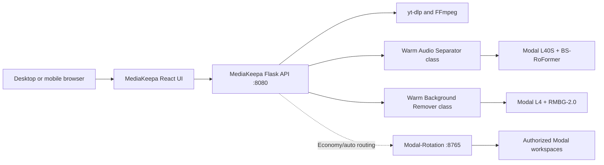

# MediaKeepa current operational state

**Snapshot date:** August 12, 2026

**Repository:** `haroldscode-oss/MediaKeepa`

**Primary branch:** `main`

This document records what MediaKeepa currently is and how the checked-in application is configured. It is an operational snapshot, not a list of every experiment or a promise that unimplemented roadmap features already exist.

## Current status

MediaKeepa currently has three functional user-facing tools in one responsive React interface:

| Tool | Current implementation | Output |
| --- | --- | --- |
| Media Downloader | yt-dlp with FFmpeg processing and platform-specific fallbacks | Video, audio, image, and caption downloads |
| Audio Separator | Quality-first BS-RoFormer inference on Modal | Lossless `vocals.wav`, `music.wav`, and a ZIP containing both |
| Background Remover | Bria RMBG-2.0 inference on Modal | Full-resolution transparent RGBA PNG |

Routes:

- `/` and `/downloader`
- `/audio-separator`
- `/background-remover`

The interface supports desktop and mobile layouts, navigation without losing the selected theme, upload progress/status polling, previews, and result downloads.

## Media Downloader

The downloader accepts supported HTTP(S) media URLs and exposes only formats found for that media.

- Video containers: MP4, MKV, and WebM
- Audio formats: MP3, M4A, and FLAC
- Images: PNG, JPG, and WebP
- Captions: TXT, SRT, and VTT with on-demand language discovery
- Selectable video resolutions and audio bitrates when available
- Download progress, recent URLs, media metadata, thumbnails, and preview support

yt-dlp remains the general extractor. FFmpeg handles conversion and merging. MediaKeepa includes retry/client handling for YouTube and accepts optional YouTube cookies. Public TikTok posts have an official-player metadata and download fallback when yt-dlp receives an unexpected webpage response.

Supported sites ultimately depend on the installed yt-dlp version and on each platform's current access rules. DRM-protected or account-restricted media is not guaranteed to work.

## Audio Separator

### Quality and model

- Model: `model_bs_roformer_ep_317_sdr_12.9755.ckpt`
- Engine: `audio-separator[gpu]`
- Active Fast-mode GPU: NVIDIA L40S
- Accepted input: MP3, WAV, FLAC, M4A, AAC, and OGG
- Maximum upload size: 50 MB
- Output: two lossless WAV stems named Vocals and Music

The Music stem is the complete non-vocal accompaniment. The browser can preview both stems, control them independently, and download either stem or a ZIP containing both.

The model is not weakened in Fast mode. The latency work changes scheduling and packaging, not the separator checkpoint or output encoding. WAV files are stored directly in the final ZIP because attempting to deflate already-uncompressed audio delayed job completion without improving audio quality.

### Runtime

The Modal app is `mediakeepa-audio-separator`. Weights are cached in the `mediakeepa-audio-models` Volume. The class-based worker loads the checkpoint in `@modal.enter()` before it accepts requests. Fast mode keeps one L40S container warm and permits up to two containers.

The legacy `separate_audio` Modal function remains available for Modal-Rotation compatibility.

## Background Remover

### Quality and model

- Model: `briaai/RMBG-2.0`
- Active Fast-mode GPU: NVIDIA L4
- Accepted input: JPG/JPEG, PNG, and WebP
- Maximum upload size: 20 MB
- Maximum dimensions: 16,000 pixels per side and 64 megapixels total
- Output: transparent RGBA PNG at the original image dimensions

The model performs inference at its configured 1024-by-1024 input size and resizes the predicted mask back to the original dimensions before applying it. The result remains a lossless PNG. Low PNG compression is used for faster delivery; that changes file size and encoding effort, not pixel quality.

The Modal app and persistent Volume are both named `mediakeepa-background-remover`. The Modal secret `MediaKeepa_backgroundremover` must contain `HF_TOKEN`, and the Hugging Face account behind that token must have accepted the gated RMBG-2.0 terms. The self-hosted model is non-commercial unless a separate Bria agreement applies.

The class-based worker loads the model and warms CUDA inference before accepting traffic. Fast mode keeps one L4 container warm and permits up to three containers. The legacy `remove_background` function remains available for Modal-Rotation compatibility.

## Active architecture



The Flask server serves both the compiled frontend under `spark-template/dist` and the API. There is no separate frontend server in normal operation.

## Fast and Economy modes

### Fast mode - current recommended configuration

`set-mediakeepa-performance.ps1 -Mode Fast` deploys the workers with:

| Setting | Audio Separator | Background Remover |
| --- | --- | --- |
| Backend | Direct Modal class | Direct Modal class |
| GPU | L40S | L4 |
| Minimum warm containers | 1 | 1 |
| Buffer containers | 0 | 0 |
| Scale-down window | 1,200 seconds | 1,200 seconds |

Direct class calls remove Modal-Rotation submission polling and artifact relaying from the interactive critical path. Fast mode is saved in `.runtime/performance-mode`; a normal stop/start therefore preserves the direct backends.

This configuration reserved approximately `$2.75/hour` in GPU capacity when documented, before CPU and memory. Modal pricing can change, so treat this as an operating estimate rather than a permanent price.

### Economy mode

`set-mediakeepa-performance.ps1 -Mode Economy` deploys L4 workers that may scale to zero after 60 seconds and restores `auto` backend selection.

In automatic mode:

1. Modal-Rotation may select an eligible configured workspace.
2. Direct Modal is the next audio fallback when the control plane is unavailable before submission.
3. Local Demucs is the final Audio Separator safety fallback.

Economy mode reduces idle GPU cost but can add cold-start, control-plane polling, and artifact-transfer latency.

## Modal-Rotation's role

The bundled `modal-rotation` submodule remains operational and useful for multi-workspace/account selection. It is intentionally bypassed only for latency-sensitive interactive calls in Fast mode. It remains available for Economy/automatic routing and for workloads where balancing across authorized workspaces matters more than the lowest response time.

The local control plane binds to `127.0.0.1:8765` and stores its workspace credentials with Windows DPAPI. Do not expose it publicly. See [../MODAL_ROTATION_INTEGRATION.md](../MODAL_ROTATION_INTEGRATION.md) for its deployment and security boundaries.

## Performance validation

After deploying Fast mode and then performing an ordinary stop/start in a fresh PowerShell process, an end-to-end local API benchmark measured:

| Test input | Upload-to-ready time | Reported processor |
| --- | ---: | --- |
| Generated 800 x 800 PNG | 3.83 seconds | `modal-l4-rmbg-2.0` |
| Generated 22-second WAV | 7.54 seconds | `modal-l40s-bs-roformer` |

These measurements include local upload, API job creation, Modal invocation, result transfer, validation, and readiness polling. They demonstrate the configured path; they are not a latency SLA, and real times vary with input size, network conditions, concurrent load, and Modal infrastructure.

The speed improvements came from:

- keeping quality models loaded in warm Modal class containers
- routing interactive Fast-mode calls directly to those classes
- preserving Fast mode across restarts
- eliminating redundant full-resolution PNG recompression
- using low-effort, lossless PNG encoding on the worker
- storing lossless WAV stems without wasteful ZIP deflation

## Access

Local desktop access is `http://127.0.0.1:8080`. The launcher binds MediaKeepa to `0.0.0.0`, detects the computer's LAN IPv4 address, and prints a phone-accessible `http://<LAN-IP>:8080` URL. The phone and computer must be on the same network, and Windows Firewall must allow inbound TCP port `8080`.

The Modal-Rotation dashboard remains local at `http://127.0.0.1:8765` and should not be exposed to the phone or public internet.

## Operational commands

```powershell
# Start the UI, API, and local control plane
.\start-mediakeepa.ps1

# Stop them
.\stop-mediakeepa.ps1

# Deploy and retain the low-latency configuration
.\set-mediakeepa-performance.ps1 -Mode Fast

# Return to scale-to-zero and automatic workspace routing
.\set-mediakeepa-performance.ps1 -Mode Economy

# Run backend regression tests
.\.venv\Scripts\python.exe -m unittest discover -s tests

# Build the production frontend
Set-Location .\spark-template
npm run build
```

## Validation state at this snapshot

- Flask health endpoint: operational
- Modal-Rotation health endpoint: operational
- Backend syntax compilation: passed
- Python regression suite: 13 of 13 tests passed
- Fresh-restart Fast-mode benchmark: passed on both direct GPU processors
- Git submodule: pinned to the published Modal-Rotation `main` commit recorded by MediaKeepa

## Not implemented yet

The repository's broader product vision has included transcription, Cloud HandBrake, video enhancement, and a lawful web-torrent client. Those are not part of the current operational UI/API snapshot and should be treated as future work until implemented and validated.
